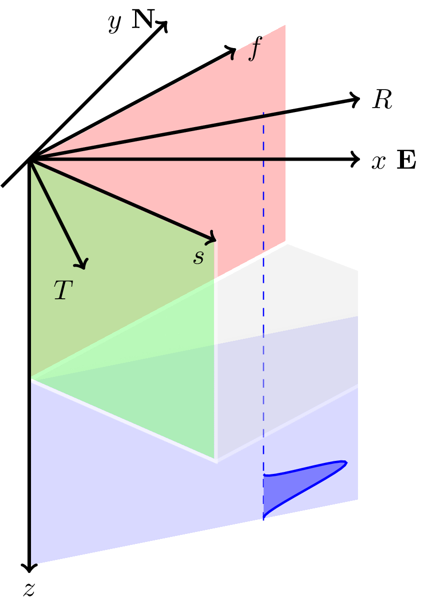

### TikZ animation

This animation illustrates so-called Shear-Wave Splitting (SWS) which can occure when a seismic shear-wave travels in an anisotropic medium. Here we are looking at a horizontal transverse isotropic (HTI) medium with fast and a slow vertical planes. When the initial polarization of the seismic wave is not alligned with one of these two planes, it will split into a fast traveling wave polarized in the fast plane *f* and into a slow traveling wave polarized in the slow plane *s*. This can be observed in the animation below.    



The animation was created using TikZ. The code is contained in the file `animateSWS.tex` which creates a `PDF` file.

To convert the `PDF` file to an animated `GIF` file, I used:
```
convert -density 400 -delay 13 -loop 0 -background white -alpha remove animateSWS.pdf images/SWS.gif
```
